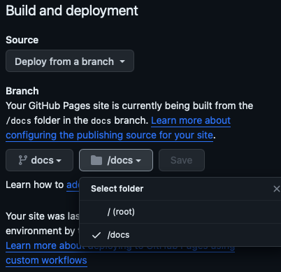

# FOSS4G 2023 Baltimore

Presentation presented Oct 25, 2023.

* See the final presentation at <https://roblabs.com/bwi2023/documentation/bwi2023/>
* Based on the template <https://github.com/roblabs/swift-docc-template>

---

## Build

### DocC with Docker

Swift-DocC is integrated with the Swift toolchain since Swift 5.6.

With Docker, consider using `docc convert` instead of `docc preview`, and then plan on using your own web server.

To install Swift Docker see:  <https://www.swift.org/install/linux/#installation-via-docker>

```console
# docker pull swift
docker run --rm --privileged --interactive --tty \
  --volume $(pwd):/home                          \
  --name swift-latest swift:latest /bin/bash
```

```console
# within Docker be sure to `cd home` to access the local volume
cd home
# make a temporary directory output
mkdir tmp
```

### Staging

Convert documentation from a source bundle

* Set a test output folder
* serve that folder for testing
* Do not commit to GH Pages, as the `baseUrl` is set for local testing.

```console
# docc -h
# docc convert -h
docc convert Documentation.docc --output-path tmp/distFromDocker
```

```console
serve tmp/distFromDocker
# http://localhost:3000/documentation/bwi2023
```

### Production

Convert documentation from a source bundle, and prepare for hosting on GH Pages

Since we used the switch `--hosting-base-path docs`, then this is the version that would be posted to GitHub Pages and assumes that the root is `/docs`.

* Set the producttion output folder
* you will not be able to serve that folder for testing
* This can be committed to GH Pages, as the `baseUrl` is set for production


```console
docc convert Documentation.docc --output-path docs --hosting-base-path bwi2023
```

### GitHub Settings for DocC

* Output the generated HTML to `<repo_root>/docs` on the local drive
* Set the branch to `docs`and serve from GH Pages the folder within the branch called `/docs`

